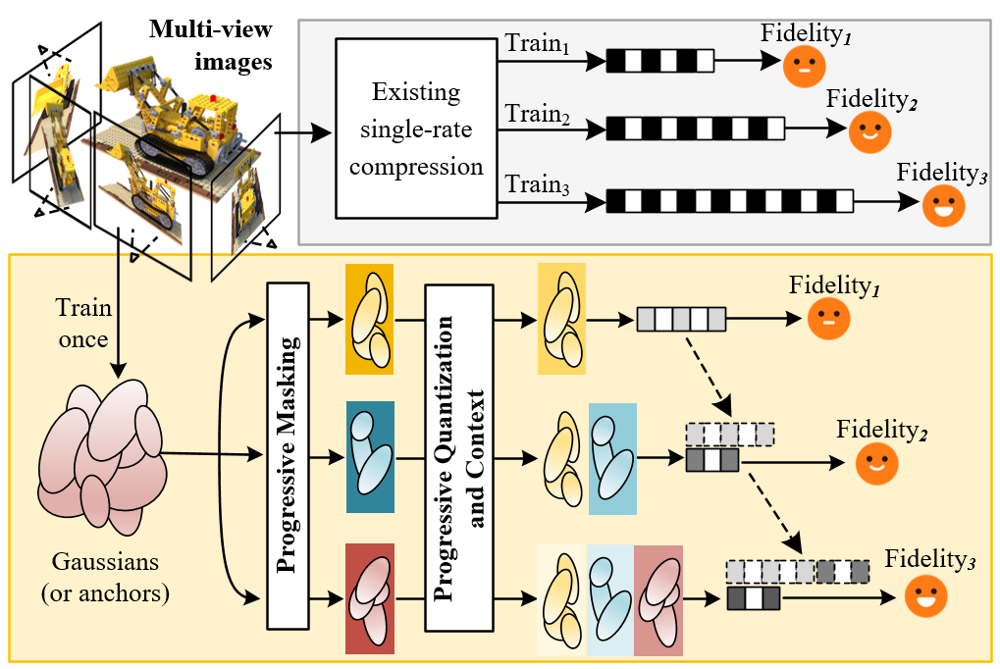
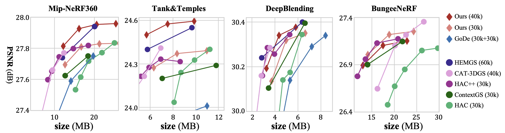

# [ARXIV'25] PCGS
Official Pytorch implementation of **PCGS: Progressive Compression of 3D Gaussian Splatting**.
## PCGS provides a progressive compression solution for on-demand applications such as dynamic bandwidth and diversion storage conditions.

[Yihang Chen*](https://yihangchen-ee.github.io), 
[Mengyao Li*](https://scholar.google.com/citations?user=fAIEYrEAAAAJ&hl=zh-CN&oi=ao), 
[Qianyi Wu](https://qianyiwu.github.io), 
[Weiyao Lin](https://weiyaolin.github.io),
[Mehrtash Harandi](https://sites.google.com/site/mehrtashharandi/),
[Jianfei Cai](http://jianfei-cai.github.io)

[[`Arxiv`](https://arxiv.org/pdf/xxxx.xxxxx)] [[`Project`](https://yihangchen-ee.github.io/project_pcgs/)] [[`Github`](https://github.com/YihangChen-ee/PCGS)]

## Links
You are welcomed to check a series of works from our group on 3D radiance field representation compression as listed below:
- 🎉 [CNC](https://github.com/yihangchen-ee/cnc/) [CVPR'24] is now released for efficient NeRF compression! [[`Paper`](https://openaccess.thecvf.com/content/CVPR2024/papers/Chen_How_Far_Can_We_Compress_Instant-NGP-Based_NeRF_CVPR_2024_paper.pdf)] [[`Arxiv`](https://arxiv.org/pdf/2406.04101)] [[`Project`](https://yihangchen-ee.github.io/project_cnc/)]
- 🏠 [HAC](https://github.com/yihangchen-ee/hac/) [ECCV'24] is now released for efficient 3DGS compression! [[`Paper`](https://www.ecva.net/papers/eccv_2024/papers_ECCV/papers/01178.pdf)] [[`Arxiv`](https://arxiv.org/pdf/2403.14530)] [[`Project`](https://yihangchen-ee.github.io/project_hac/)]
- 💪 [HAC++](https://github.com/yihangchen-ee/hac-plus/) [ARXIV'25] is an enhanced compression method over HAC! [[`Arxiv`](https://arxiv.org/pdf/2501.12255)] [[`Project`](https://yihangchen-ee.github.io/project_hac++/)]
- 🚀 [FCGS](https://github.com/yihangchen-ee/fcgs/) [ICLR'25] is now released for fast optimization-free 3DGS compression! [[`Paper`](https://openreview.net/pdf?id=DCandSZ2F1)] [[`Arxiv`](https://arxiv.org/pdf/2410.08017)] [[`Project`](https://yihangchen-ee.github.io/project_fcgs/)]
- 🪜 [PCGS](https://github.com/yihangchen-ee/pcgs/) [ARXIV'25] is now released for progressive 3DGS compression! [[`Arxiv`](https://arxiv.org/pdf/xxxx.xxxxx)] [[`Project`](https://yihangchen-ee.github.io/project_pcgs/)]

## Overview
<p align="left">

</p>

We propose **PCGS** (**P**rogressive **C**ompression of 3D **G**aussian **S**platting), 
which adaptively controls **both the quantity and quality** of Gaussians (or anchors) to enable effective progressivity for on-demand applications. 
Specifically, for quantity, we introduce a progressive masking strategy that incrementally incorporates new anchors while refining existing ones to enhance fidelity. 
For quality, we propose a progressive quantization approach that gradually reduces quantization step sizes to achieve finer modeling of Gaussian attributes. 
Furthermore, to compact the incremental bitstreams, we leverage existing quantization results to refine probability prediction, improving entropy coding efficiency across progressive levels.

## Performance
<p align="left">

</p>

Diamond markers $\diamondsuit$ represent **progressive compression** methods, while circle markers $\circ$ denote traditional **single-rate compression** methods.


## Installation

The installation process follows that of [HAC++](https://github.com/YihangChen-ee/HAC-plus).

We tested our code on a server with Ubuntu 20.04.1, cuda 11.8, gcc 9.4.0.

1. Unzip files
```
cd submodules
unzip diff-gaussian-rasterization.zip
unzip gridencoder.zip
unzip simple-knn.zip
unzip arithmetic.zip
cd ..
```
2. Install environment
```
conda env create --file environment.yml
conda activate HAC_env
```

3. Install ```tmc3``` (for GPCC)

- Please refer to [tmc3 github](https://github.com/MPEGGroup/mpeg-pcc-tmc13) for installation.
- Don't forget to add ```tmc3``` to your environment variable, otherwise you must manually specify its location [in our code](https://github.com/YihangChen-ee/PCGS/blob/main/utils/gpcc_utils.py). 
- Tips: ```tmc3``` is commonly located at ```/PATH/TO/mpeg-pcc-tmc13/build/tmc3```.

## Data

First, create a ```data/``` folder inside the project path by 
```
mkdir data
```

The data structure will be organised as follows:

```
data/
├── dataset_name
│   ├── scene1/
│   │   ├── images
│   │   │   ├── IMG_0.jpg
│   │   │   ├── IMG_1.jpg
│   │   │   ├── ...
│   │   ├── sparse/
│   │       └──0/
│   ├── scene2/
│   │   ├── images
│   │   │   ├── IMG_0.jpg
│   │   │   ├── IMG_1.jpg
│   │   │   ├── ...
│   │   ├── sparse/
│   │       └──0/
...
```

 - For instance: `./data/blending/drjohnson/`
 - For instance: `./data/bungeenerf/amsterdam/`
 - For instance: `./data/mipnerf360/bicycle/`
 - For instance: `./data/nerf_synthetic/chair/`
 - For instance: `./data/tandt/train/`


### Public Data (We follow suggestions from [Scaffold-GS](https://github.com/city-super/Scaffold-GS))

 - The **BungeeNeRF** dataset is available in [Google Drive](https://drive.google.com/file/d/1nBLcf9Jrr6sdxKa1Hbd47IArQQ_X8lww/view?usp=sharing)/[百度网盘[提取码:4whv]](https://pan.baidu.com/s/1AUYUJojhhICSKO2JrmOnCA). 
 - The **MipNeRF360** scenes are provided by the paper author [here](https://jonbarron.info/mipnerf360/). And we test on its entire 9 scenes ```bicycle, bonsai, counter, garden, kitchen, room, stump, flowers, treehill```. 
 - The SfM datasets for **Tanks&Temples** and **Deep Blending** are hosted by 3D-Gaussian-Splatting [here](https://repo-sam.inria.fr/fungraph/3d-gaussian-splatting/datasets/input/tandt_db.zip). Download and uncompress them into the ```data/``` folder.

### Custom Data

For custom data, you should process the image sequences with [Colmap](https://colmap.github.io/) to obtain the SfM points and camera poses. Then, place the results into ```data/``` folder.

## Training

To train scenes, we provide the following training scripts: 
 - Tanks&Temples: ```run_shell_tnt.py```
 - MipNeRF360: ```run_shell_mip360.py```
 - BungeeNeRF: ```run_shell_bungee.py```
 - Deep Blending: ```run_shell_db.py```
 - Nerf Synthetic: ```run_shell_blender.py```

 run them with 
 ```
 python run_shell_xxx.py
 ```

The code will automatically run the entire process of: **training, encoding, decoding, testing**.
 - Multiple rate points will be run in one training process.
 - Training log will be recorded in `output.log` of the output directory. Results of **detailed fidelity, detailed size, detailed time** across different rate points will all be recorded.
 - Encoded bitstreams will be stored in `./bitstreams` of the output directory.
 - After encoding, the script will automatically decode the bitstreams into multiple models across progressive levels and store them into the folder `./decoded_model`.
 - Evaluated output images will be saved in `./test_ss{lambda_idx}` of the output directory.


## Contact

- Yihang Chen: yhchen.ee@sjtu.edu.cn

## Citation

If you find our work helpful, please consider citing:

```bibtex
@article{pcgs2025,
  title={PCGS: Progressive Compression of 3D Gaussian Splatting},
  author={Chen, Yihang and Li, Mengyao and Wu, Qianyi and Lin, Weiyao and Harandi, Mehrtash and Cai, Jianfei},
  journal={arXiv preprint arXiv:xxxx.xxxxx},
  year={2025}
}
```


## LICENSE

Please follow the LICENSE of [3D-GS](https://github.com/graphdeco-inria/gaussian-splatting).

## Acknowledgement

 - We thank all authors from [3D-GS](https://github.com/graphdeco-inria/gaussian-splatting) for presenting such an excellent work.
 - We thank all authors from [Scaffold-GS](https://github.com/city-super/Scaffold-GS) for presenting such an excellent work. 
 - We thank [Xiangrui](https://liuxiangrui.github.io)'s help on GPCC codec.
